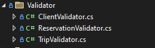

<style>
h1, h4, h2 {
    border-bottom: 0;
    display:flex;
    flex-direction: column;
    align-items: center;
    text-align: center;
      }
      
centerer{
    display: grid;
    grid-template-columns: 6fr 1fr 4fr;
    grid-template-rows: 1fr;

}
rectangle{
    border: 1px solid black;
    margin: 0px 50px 0px 50px;
    width: 200px;
    height: 4em;
    display: flex;
    flex-direction: column;
    align-items: center;
    justify-items: center;
}
Ltext{
    margin: auto auto auto 0;
    font-weight: bold;
    margin-left: 4em
}
Rtext{
    margin: auto;
}

row {
    display: flex;
    flex-direction: row;
    align-items: center;
    justify-content: center; 
}
 </style>
<h1>Uniwersytet Bielsko-Bialski</h1>

&nbsp;

&nbsp;

&nbsp;

&nbsp;

&nbsp;

&nbsp;

&nbsp;

&nbsp;

&nbsp;

<h1 style="text-align: center;"><b>LABORATORIUM</b></h1>
<h1 style="text-align:center"><b>Programowanie dla Internetu w technologii ASP.NET</b></h1>

&nbsp;

&nbsp;

<h2 style="text-align:center; border: none;"><b>Sprawozdanie nr 6</b></h3>
<h2 style="text-align:center; border: none;">Validator i AutoMapper</h2>

&nbsp;

&nbsp;

&nbsp;

&nbsp;

&nbsp;

&nbsp;

&nbsp;

GRUPA: 2B / SEMESTR: 6 / ROK: 3

Kacper Lizak / 59443

<div style="page-break-after: always;"></div>

&nbsp;

&nbsp;

&nbsp;

# Cel ćwieczenia

## Celem ćwiczenia było dodanie validatora i automappera do naszego projektu w ASP.NET

# Wprowadzenie

### 

### 


# Realizacja
## Utworzenie folderu dla AutoMappera 


<center>


</center>


## Kod AutoMappera
```cs
public class TripAutoMapper : Profile
{
   public TripAutoMapper()
    {
        CreateMap<TripViewModel, Trip>()
             .ForMember(x => x.From, opt => opt.MapFrom(src => src.From.ToUpperInvariant()))
             .ForMember(x => x.To, opt => opt.MapFrom(src => src.To.ToUpperInvariant()))
             .ForMember(x => x.StartTrip, opt => opt.MapFrom(src => src.StartTrip.ToUniversalTime()))
             .ForMember(x => x.EndTrip, opt => opt.MapFrom(src => src.EndTrip.ToUniversalTime()))
             .ReverseMap();
        CreateMap<ClientViewModel, Client>()
            .ForMember(ClientViewModel => ClientViewModel.FirstName, opt => opt.MapFrom(src => src.FirstName.ToUpperInvariant()))
            .ForMember(ClientViewModel => ClientViewModel.LastName, opt => opt.MapFrom(src => src.LastName.ToUpperInvariant()))
            .ReverseMap();
        CreateMap<ReservationViewModel, Reservation>()
            .ForMember(ReservationViewModel => ReservationViewModel.ReservationDate, opt => opt.MapFrom(src => src.ReservationDate.ToUniversalTime()))
            .ReverseMap();
    }
}
```

## Dodanie AutoMappera do buildera
```cs
builder.Services.AddAutoMapper(options =>
{
    options.AddProfile<TripAutoMapper>();
});
```

## Stworzenie folderu dla Validator'ów

<center>



</center>

## Przykładowy validator dla Client

```cs
public class ClientValidator : AbstractValidator<ClientViewModel>
{
   public ClientValidator()
    {
       RuleFor(x => x.FirstName).NotEmpty().WithMessage("First name is required");
       RuleFor(x => x.LastName).NotEmpty().WithMessage("Last name is required");
       RuleFor(x => x.Email).NotEmpty().WithMessage("Email is required");
       RuleFor(x => x.Email).EmailAddress().WithMessage("Email is not valid");
       RuleFor(x => x.Phone).NotEmpty().WithMessage("Phone is required");
       RuleFor(x => x.Phone).Length(9).WithMessage("Phone must have 9 digits");
   }
}
```

## Użycie validatora w kontrolerze 

```cs
public async Task <IActionResult> Create([Bind("IdClient,FirstName,LastName,Email,Phone")] ClientViewModel clientViewModel)
{
    var _clientValidatorR = _clientValidator.Validate(clientViewModel);
    if (_clientValidatorR.IsValid)
    {
        var client = new Client
        {
           FirstName = clientViewModel.FirstName,
           LastName = clientViewModel.LastName,
           Email = clientViewModel.Email,
           Phone = clientViewModel.Phone,
           IdClient = clientViewModel.IdClient
           

        };
        await _clientServices.InsertAsync(client);
        await _clientServices.SaveAsync();
        return RedirectToAction(nameof(Index));
    }
    return View(clientViewModel);
}
```

```cs
public async Task <IActionResult> Edit(int id, [Bind("IdClient,FirstName,LastName,Email,PhoneNumber")] ClientViewModel clientViewModel)
{
    if (id != clientViewModel.IdClient)
    {
        return NotFound();
    }
var result= _clientValidator.Validate(clientViewModel);
if (!result.IsValid)
{
    foreach (var failure in result.Errors)
    {
        ModelState.AddModelError(failure.PropertyName, failure.ErrorMessage);
    }
}
if (result.IsValid)
{
        var client = new Client
        {
            IdClient = clientViewModel.IdClient,
            FirstName = clientViewModel.FirstName,
            LastName = clientViewModel.LastName,
            Email = clientViewModel.Email,
            Phone = clientViewModel.Phone
        };
        try
        {
            _clientServices.Update(client);
            await _clientServices.SaveAsync();
        }
        catch (DbUpdateConcurrencyException)
        {
            if (!ClientExists(client.IdClient))
            {
                return NotFound();
            }
            else
            {
                throw;
            }
        }
        return RedirectToAction(nameof(Index));
    }
    return View(clientViewModel);
}
```
## Dodanie validator'ów do program.cs

```cs
// Validators
builder.Services.AddScoped<IValidator<ClientViewModel>, ClientValidator>();
builder.Services.AddScoped<IValidator<TripViewModel>, TripValidator>();
builder.Services.AddScoped<IValidator<ReservationViewModel>, ReservationValidator>();
```

## Wnioski: 
### Użycie walidatora pozwala na skuteczną weryfikację danych wejściowych, zapewniając poprawność i kompletność informacji przekazywanych do aplikacji. Z kolei wykorzystanie AutoMappera usprawnia proces mapowania danych między obiektami, co redukuje ilość powtarzalnego kodu i ułatwia zarządzanie aplikacją poprzez automatyzację tego procesu. Kombinacja tych narzędzi znacząco zwiększa niezawodność i czytelność kodu oraz przyspiesza rozwój oprogramowania.
