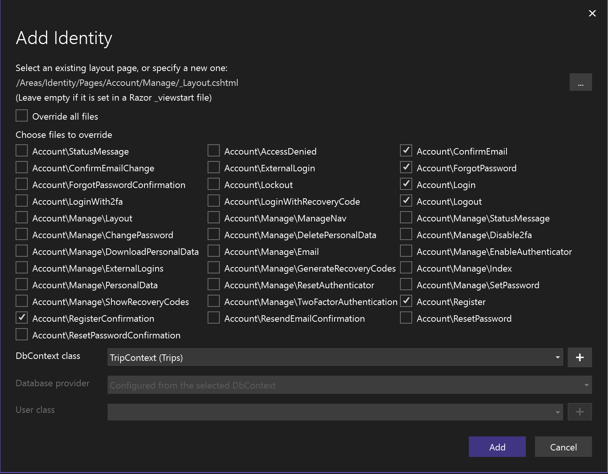
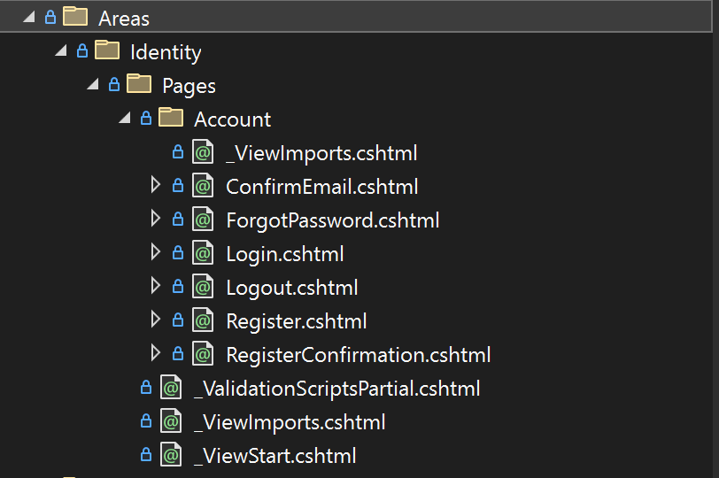
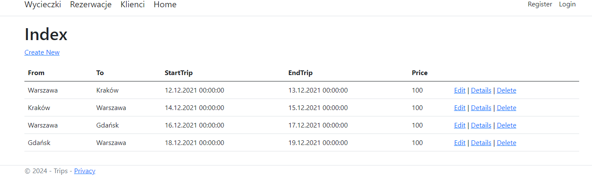
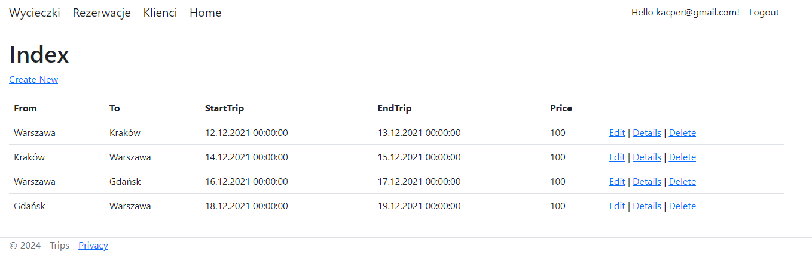
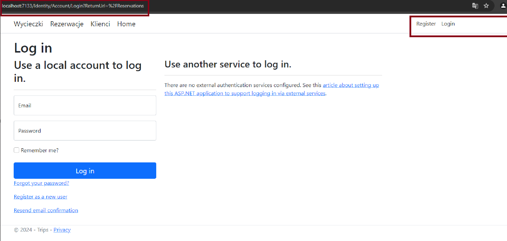
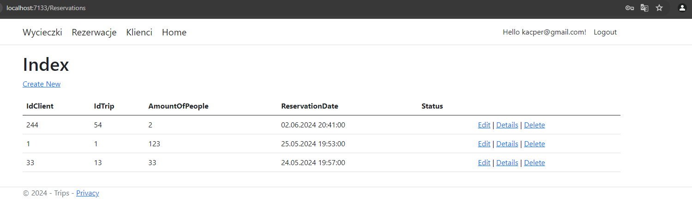

<style>
h1, h4, h2 {
    border-bottom: 0;
    display:flex;
    flex-direction: column;
    align-items: center;
    text-align: center;
      }
      
centerer{
    display: grid;
    grid-template-columns: 6fr 1fr 4fr;
    grid-template-rows: 1fr;

}
rectangle{
    border: 1px solid black;
    margin: 0px 50px 0px 50px;
    width: 200px;
    height: 4em;
    display: flex;
    flex-direction: column;
    align-items: center;
    justify-items: center;
}
Ltext{
    margin: auto auto auto 0;
    font-weight: bold;
    margin-left: 4em
}
Rtext{
    margin: auto;
}

row {
    display: flex;
    flex-direction: row;
    align-items: center;
    justify-content: center; 
}
 </style>
<h1>Uniwersytet Bielsko-Bialski</h1>

&nbsp;

&nbsp;

&nbsp;

&nbsp;

&nbsp;

&nbsp;

&nbsp;

&nbsp;

&nbsp;

<h1 style="text-align: center;"><b>LABORATORIUM</b></h1>
<h1 style="text-align:center"><b>Programowanie dla Internetu w technologii ASP.NET</b></h1>

&nbsp;

&nbsp;

<h2 style="text-align:center; border: none;"><b>Sprawozdanie nr 7</b></h3>
<h2 style="text-align:center; border: none;">Uproszczona autoryzacja</h2>

&nbsp;

&nbsp;

&nbsp;

&nbsp;

&nbsp;

&nbsp;

&nbsp;

GRUPA: 2B / SEMESTR: 6 / ROK: 3

Kacper Lizak / 59443

<div style="page-break-after: always;"></div>

&nbsp;

&nbsp;

&nbsp;

# Cel ćwieczenia

## Celem ćwiczenia było zapoznanie się z podstawami uwierzytelniania i autoryzacji użytkowników w aplikacjach tworzonych za pomocą ASPNET Core Identity.


# Wprowadzenie

### Uwierzytelnienie to proces polegający na potwierdzeniu zadeklarowanej tożsamości podmiotu biorącego udział w procesie komunikacji. W praktyce odbywa się to poprzez porównanie przedstawionych przez użytkownika dowodów tożsamości z danymi przechowywanymi w systemie. Celem uwierzytelniania jest uzyskanie określonego poziomu pewności, że dany podmiot jest w rzeczywistości tym, za którego się podaje.

### Autoryzacja to proces nadawania podmiotowi dostępu do zasobu. Celem autoryzacji jest kontrola dostępu, która potwierdza, czy dany podmiot jest uprawniony do korzystania z żądanego zasobu. Autoryzacja następuje dopiero po potwierdzeniu tożsamości podmiotu za pomocą identyfikacji i uwierzytelnienia.

### Microsoft.AspNetCore.Identity to interfejs API, który obsługuje funkcje logowania interfejsu użytkownika. Zarządza użytkownikami, hasłami, danymi profilu, rolami, oświadczeniami, tokenami, potwierdzeniem wiadomości e-mail i nie tylko. Użytkownicy mogą utworzyć konto przy użyciu informacji logowania przechowywanych w Identity lub mogą użyć zewnętrznego dostawcy logowania. ASP.NET Core Identity dodaje funkcje logowania interfejsu użytkownika do aplikacji internetowych platformy ASP.NET Core


# Wykonanie ćwiczenia

## W pierwszej kolejności należy zmienić dziedziczenie klasy TripContext z DbContext (EF Core) na IdentityDbContext (ASPNET Core Identity)

```cs
public class TripContext : IdentityDbContext<IdentityUser>
{
    public DbSet<Trip> Trips { get; set; }
    public DbSet<Client> Clients { get; set; }
    public DbSet<Reservation> Reservations { get; set; }
    public TripContext(DbContextOptions<TripContext> options) : base(options)
    {
    }

    protected override void OnModelCreating(ModelBuilder modelBuilder)
    {
        base.OnModelCreating(modelBuilder);
        modelBuilder.Entity<Trip>().ToTable("Trips");
        modelBuilder.Entity<Client>().ToTable("Clients");
        modelBuilder.Entity<Reservation>().ToTable("Reservations");
    }
}
```

## Następnie za pomocą scaffoldingu wygenerować widoki dla następujących zachwań : 
### 1.Rejestracja
### 2.Logowanie
### 3.Wylogowywanie
### 4.Potwierdzenie rejestracji
### 5.Przypomnienie hasła
<center>



</center>

## Co zostało wygenerowane : 
<center>



</center>

## Mapowanie mechanizmuu uwierzytelniania, autoryzacji oraz mapowania stron blazor.

```cs
app.UseAuthentication();
app.UseAuthorization();
app.MapRazorPages();
```

## Przykład użycia udostępniania dostępu do danego kontrolera osobom nieuwierzytelnionym 

```cs
    [AllowAnonymous]
    public class TripsController : Controller
```

<center>


</center>

<center>



</center>

### Jak widać użytkownik niezależnie od tego czy jest zalogowany czy nie widzi dokładnie to samo.

##
#
#
#


## Przykład który niezalogowanemu użytkownikowi nie pozwoli zobaczyć rezerwacji: 

```cs
[Authorize]
public class ReservationsController : Controller
```

### Widok dla niezalogowanego użytkownika :


### Widok dla zalogowanego użytkownika :


# Wnioski

### Ćwiczenie to pozwoliło na zrozumienie i praktyczne zastosowanie uwierzytelniania i autoryzacji w aplikacjach ASP.NET Core za pomocą ASPNET Core Identity. Zabezpieczenie dostępu do stron aplikacji poprzez implementację uwierzytelniania i autoryzacji jest kluczowym elementem w tworzeniu bezpiecznych aplikacji internetowych.
