<style>
h1, h4, h2 {
    border-bottom: 0;
    display:flex;
    flex-direction: column;
    align-items: center;
    text-align: center;
      }
      
centerer{
    display: grid;
    grid-template-columns: 6fr 1fr 4fr;
    grid-template-rows: 1fr;

}
rectangle{
    border: 1px solid black;
    margin: 0px 50px 0px 50px;
    width: 200px;
    height: 4em;
    display: flex;
    flex-direction: column;
    align-items: center;
    justify-items: center;
}
Ltext{
    margin: auto auto auto 0;
    font-weight: bold;
    margin-left: 4em
}
Rtext{
    margin: auto;
}

row {
    display: flex;
    flex-direction: row;
    align-items: center;
    justify-content: center; 
}
 </style>
<h1>Uniwersytet Bielsko-Bialski</h1>

&nbsp;

&nbsp;

&nbsp;

&nbsp;

&nbsp;

&nbsp;

&nbsp;

&nbsp;

&nbsp;

<h1 style="text-align: center;"><b>LABORATORIUM</b></h1>
<h1 style="text-align:center"><b>Programowanie dla Internetu w technologii ASP.NET</b></h1>

&nbsp;

&nbsp;

<h2 style="text-align:center; border: none;"><b>Sprawozdanie nr 8</b></h3>
<h2 style="text-align:center; border: none;">System ról</h2>

&nbsp;

&nbsp;

&nbsp;

&nbsp;

&nbsp;

&nbsp;

&nbsp;

GRUPA: 2B / SEMESTR: 6 / ROK: 3

Kacper Lizak / 59443

<div style="page-break-after: always;"></div>

&nbsp;

&nbsp;

&nbsp;

# Cel ćwieczenia

## Celem ćwiczenia było stworzenie i przypisanie ról użytkownikom.


# Wprowadzenie

## Współczesne aplikacje internetowe często wymagają zarządzania różnorodnymi uprawnieniami użytkowników, aby zapewnić bezpieczeństwo oraz odpowiednie funkcjonowanie systemu. Jednym z kluczowych aspektów zarządzania uprawnieniami jest implementacja systemu ról. W systemie tym użytkownicy są przypisywani do określonych ról, które definiują ich prawa dostępu do różnych funkcjonalności aplikacji.

## W ramach niniejszego ćwiczenia naszym celem było stworzenie i przypisanie ról użytkownikom w aplikacji internetowej opartej na technologii ASP.NET. Dzięki temu rozwiązaniu możemy kontrolować, które zasoby i operacje są dostępne dla poszczególnych użytkowników na podstawie przypisanych im ról.

# Stworzenie ról

## Dodanie ról do DbInitializera
```cs
var Roles = new IdentityRole[]
{
    new IdentityRole { Name = "Admin", NormalizedName = "ADMIN", Id = "1" },
    new IdentityRole { Name = "Manager", NormalizedName = "MANAGER", Id = "2"},
    new IdentityRole { Name = "Member", NormalizedName = "MEMBER", Id = "3"}
};
foreach (IdentityRole r in Roles)
{
    context.Roles.Add(r);
}
context.SaveChanges();
```

## Efekt przy tworzeniu bazy danych :
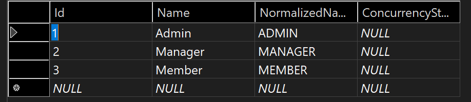

## Przypisanie ról użytkownikom : 

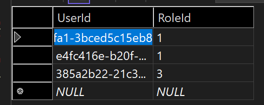

## Stworzenie widoków dla Admina do zarządzania rolami użytkowników:

``` html
@model List<Microsoft.AspNetCore.Identity.IdentityUser>

<h1>Users</h1>

<table class="table">
    <thead>
        <tr>
            <th>User Name</th>
            <th>Email</th>
            <th>Actions</th>
        </tr>
    </thead>
    <tbody>
        @foreach (var user in Model)
        {
            <tr>
                <td>@user.UserName</td>
                <td>@user.Email</td>
                <td>
                    <a href="@Url.Action("ManageRoles", new { userId = user.Id })" class="btn btn-primary">Manage Roles</a>
                </td>
            </tr>
        }
    </tbody>
</table>

```

## Jak to wygląda :
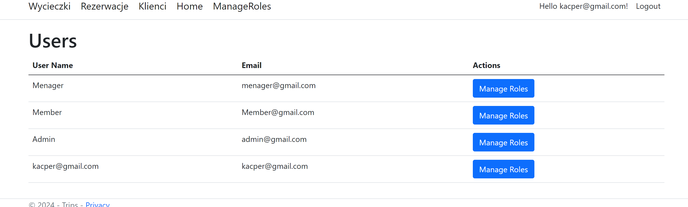

## Kod dla samego "ManageRoles"

```html
@model TripsS.ViewModel.ManageRolesViewModel

<h1>Manage Roles for @Model.UserId</h1>

<form asp-action="UpdateRoles" method="post">
    <input type="hidden" name="userId" value="@Model.UserId" />
    <div class="form-group">
        @foreach (var role in Model.AllRoles)
        {
            <div class="form-check">
                <input class="form-check-input" type="checkbox" name="roles" value="@role.Name" id="role_@role.Name" @(Model.UserRoles.Contains(role.Name) ? "checked" : "")>
                <label class="form-check-label" for="role_@role.Name">@role.Name</label>
            </div>
        }
    </div>
    <button type="submit" class="btn btn-primary">Update Roles</button>
</form>
```

## Sam widok: 
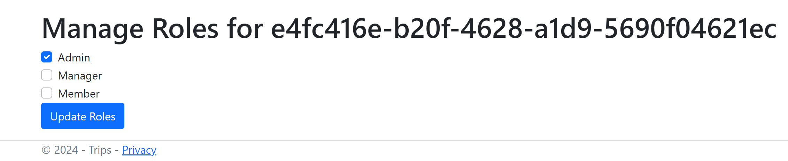

## Przykładowe wykorzystanie roli: 
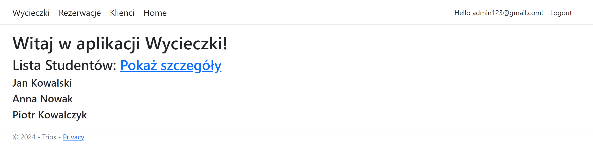

## Jak widać użytkownik admin123 nie widzi nawet zarządzania użytkownikami, a spodowane jest to następującym kodem :

```html
@if (User.IsInRole("Admin"))
{
    <a class="navbar-brand" asp-area="" asp-controller="Admin" asp-action="Index">ManageRoles</a>
}
```

## Teraz przypiszemy temu użytkownikowi rolę "Manager"
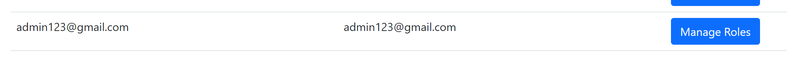


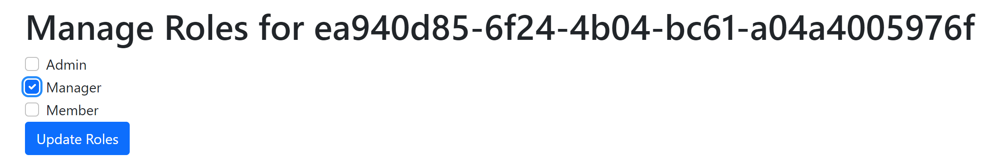

## Dzięki tej roli ma dostęp do np. zarządzania klientami :
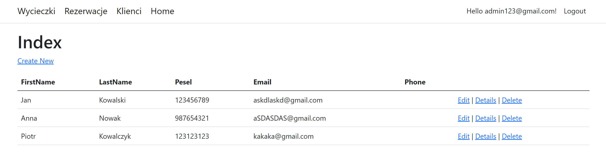

## Dzieje się to dzięki :

```cs
[Authorize(Roles = "Manager,Admin")]
public class ClientsController : Controller
```
### Do tej klasy i jej metod mają dostęp tylko Manager i Admin

## Manager może tworzyć i edytować rezerwacje:
```cs
 [Authorize(Roles = "Manager,Admin")]
 public async Task<IActionResult> Edit(Guid id, [Bind("IdReservation,IdClient,IdTrip,AmountOfPeople,ReservationDate,Status")] ReservationViewModel reservationViewModel)
 ```
 ```cs
 [Authorize(Roles = "Manager,Admin")]
public async Task<IActionResult> Create([Bind("IdReservation,IdClient,IdTrip,AmountOfPeople,ReservationDate,Status")] ReservationViewModel reservationViewModel)
```
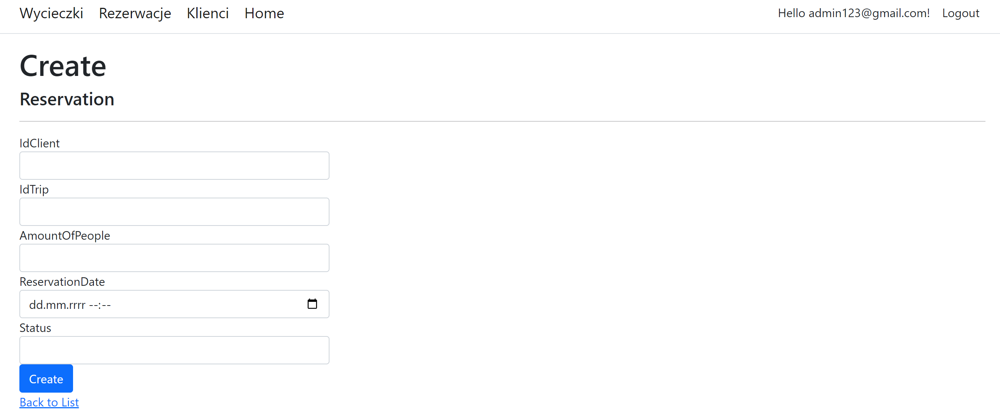

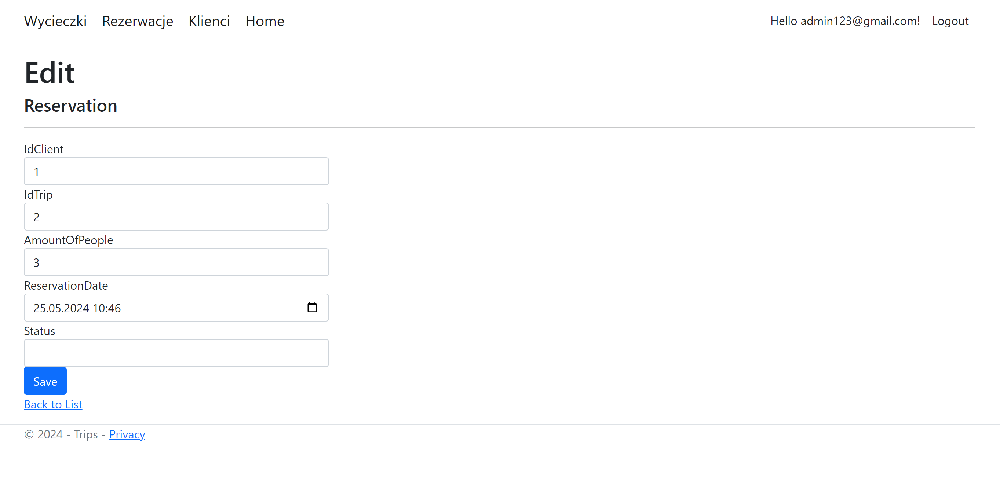

## Ale nie może ich usuwać :
```cs
[Authorize(Roles = "Admin")]
public async Task<IActionResult> Delete(Guid? id)
```
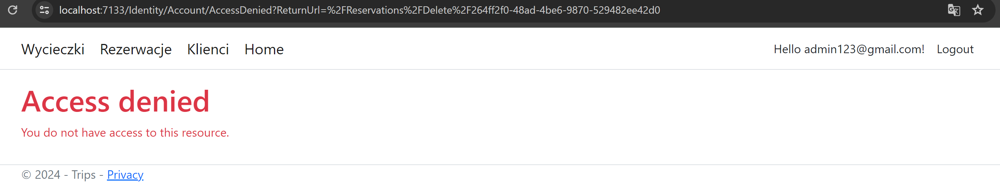

## Wnioski

### Dzięki temu ćwiczeniu dowiedzieliśmy się jak stworzyć role i przypisać je do użytkowników, a także jak wykorzystać role w naszym projekcie.  Dzięki temu możemy przydzielać różne uprawnienia różnym użytkownikom i w zależności od tego wyświetlać im różne widoki.