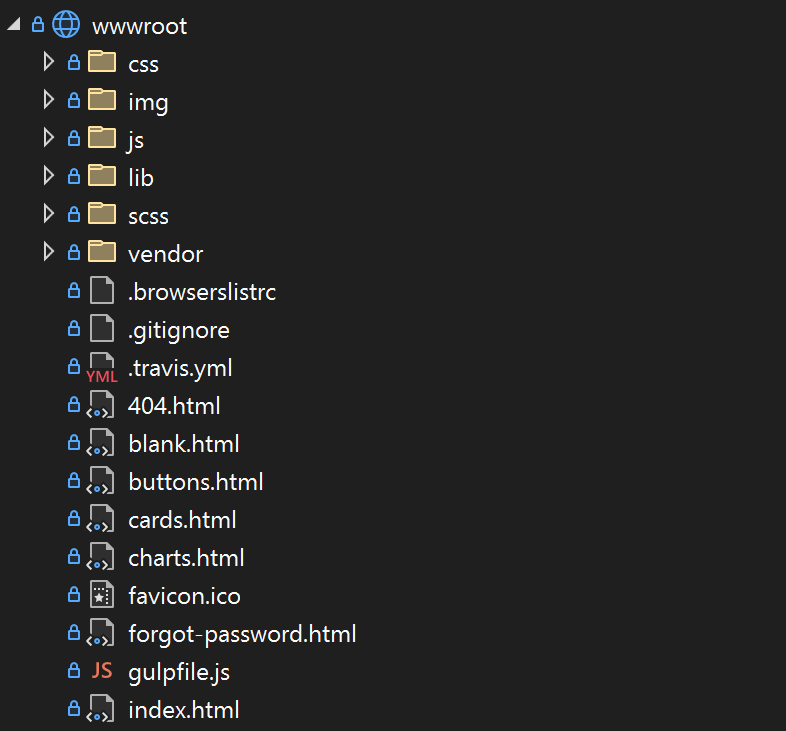
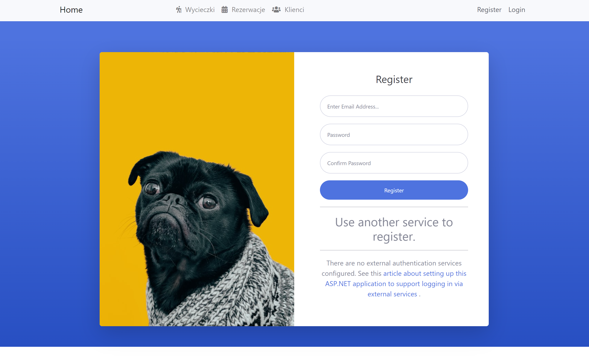
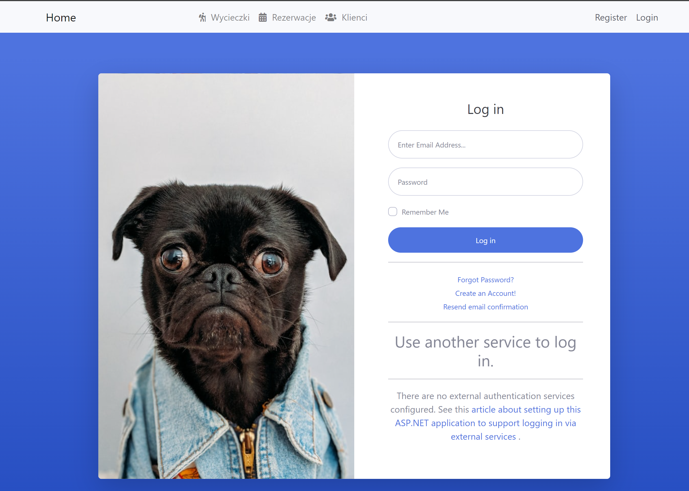
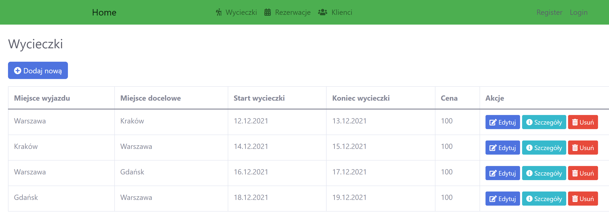
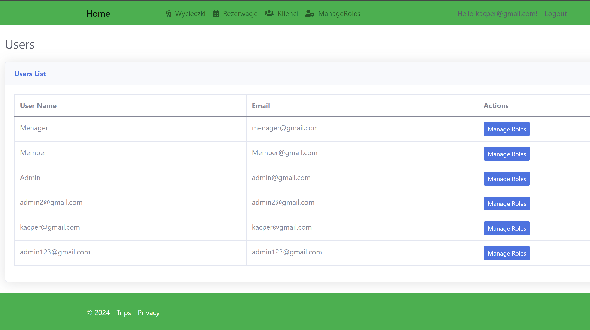

<style>
h1, h4, h2 {
    border-bottom: 0;
    display:flex;
    flex-direction: column;
    align-items: center;
    text-align: center;
      }
      
centerer{
    display: grid;
    grid-template-columns: 6fr 1fr 4fr;
    grid-template-rows: 1fr;

}
rectangle{
    border: 1px solid black;
    margin: 0px 50px 0px 50px;
    width: 200px;
    height: 4em;
    display: flex;
    flex-direction: column;
    align-items: center;
    justify-items: center;
}
Ltext{
    margin: auto auto auto 0;
    font-weight: bold;
    margin-left: 4em
}
Rtext{
    margin: auto;
}

row {
    display: flex;
    flex-direction: row;
    align-items: center;
    justify-content: center; 
}
 </style>
<h1>Uniwersytet Bielsko-Bialski</h1>

&nbsp;

&nbsp;

&nbsp;

&nbsp;

&nbsp;

&nbsp;

&nbsp;

&nbsp;

&nbsp;

<h1 style="text-align: center;"><b>LABORATORIUM</b></h1>
<h1 style="text-align:center"><b>Programowanie dla Internetu w technologii ASP.NET</b></h1>

&nbsp;

&nbsp;

<h2 style="text-align:center; border: none;"><b>Sprawozdanie nr 9</b></h3>
<h2 style="text-align:center; border: none;">Nowy Layout aplikacji</h2>

&nbsp;

&nbsp;

&nbsp;

&nbsp;

&nbsp;

&nbsp;

&nbsp;

GRUPA: 2B / SEMESTR: 6 / ROK: 3

Kacper Lizak / 59443

<div style="page-break-after: always;"></div>

&nbsp;

&nbsp;

&nbsp;

# Cel ćwieczenia
## Celem ćwiczenia było stworzenie lepszego layoutu dla aplikacji przy pomocy SB Admin 2


# Wprowadzenie

## SB Admin 2 to darmowy szablon interfejsu użytkownika (UI), oparty na Bootstrapie 4, który zapewnia gotowe komponenty i stylizację do szybkiego tworzenia responsywnych paneli administracyjnych. Zawiera wiele przydatnych funkcji, takich jak nawigacja, tabele danych, formularze, wykresy i wiele innych, co pozwala programistom skoncentrować się na funkcjonalności swojej aplikacji zamiast na projektowaniu interfejsu użytkownika od podstaw.


# Dodanie wszystkich niezbędnych plików do projektu:
<center>


</center>

# Użycie tej biblioteki żeby stworzyć nowy widok dla logowania oraz rejestracji, które wyglądają teraz następująco :
<center>



</center>

## Przykładowy kod panelu rejestracji:

```html
@page
@model RegisterModel
@{
    ViewData["Title"] = "Register";
}

<!DOCTYPE html>
<html lang="en">
<head>
    <meta charset="UTF-8">
    <meta name="viewport" content="width=device-width, initial-scale=1.0">
    <title>@ViewData["Title"]</title>
    <!-- SB Admin 2 CSS -->
    <link href="~/vendor/fontawesome-free/css/all.min.css" rel="stylesheet" type="text/css">
    <link href="~/css/sb-admin-2.min.css" rel="stylesheet">
</head>
<body class="bg-gradient-primary">
    <div class="container">
        <!-- Outer Row -->
        <div class="row justify-content-center">
            <div class="col-xl-10 col-lg-12 col-md-9">
                <div class="card o-hidden border-0 shadow-lg my-5">
                    <div class="card-body p-0">
                        <!-- Nested Row within Card Body -->
                        <div class="row">
                            <div class="col-lg-6 d-none d-lg-block bg-register-image"></div>
                            <div class="col-lg-6">
                                <div class="p-5">
                                    <div class="text-center">
                                        <h1 class="h4 text-gray-900 mb-4">@ViewData["Title"]</h1>
                                    </div>
                                    <form id="registerForm" asp-route-returnUrl="@Model.ReturnUrl" method="post" class="user">
                                        <div asp-validation-summary="ModelOnly" class="text-danger" role="alert"></div>
                                        <div class="form-group">
                                            <input asp-for="Input.Email" class="form-control form-control-user" autocomplete="username" aria-required="true" placeholder="Enter Email Address...">
                                            <span asp-validation-for="Input.Email" class="text-danger"></span>
                                        </div>
                                        <div class="form-group">
                                            <input asp-for="Input.Password" class="form-control form-control-user" autocomplete="new-password" aria-required="true" placeholder="Password">
                                            <span asp-validation-for="Input.Password" class="text-danger"></span>
                                        </div>
                                        <div class="form-group">
                                            <input asp-for="Input.ConfirmPassword" class="form-control form-control-user" autocomplete="new-password" aria-required="true" placeholder="Confirm Password">
                                            <span asp-validation-for="Input.ConfirmPassword" class="text-danger"></span>
                                        </div>
                                        <button id="registerSubmit" type="submit" class="btn btn-primary btn-user btn-block">Register</button>
                                    </form>
                                    <hr>
                                    <div class="text-center">
                                        <h3>Use another service to register.</h3>
                                        <hr>
                                        @{
                                            if ((Model.ExternalLogins?.Count ?? 0) == 0)
                                            {
                                                <div>
                                                    <p>
                                                        There are no external authentication services configured. See this <a href="https://go.microsoft.com/fwlink/?LinkID=532715">
                                                            article
                                                            about setting up this ASP.NET application to support logging in via external services
                                                        </a>.
                                                    </p>
                                                </div>
                                            }
                                            else
                                            {
                                                <form id="external-account" asp-page="./ExternalLogin" asp-route-returnUrl="@Model.ReturnUrl" method="post" class="user">
                                                    <div>
                                                        <p>
                                                            @foreach (var provider in Model.ExternalLogins!)
                                                            {
                                                                <button type="submit" class="btn btn-primary btn-user btn-block" name="provider" value="@provider.Name" title="Register using your @provider.DisplayName account">@provider.DisplayName</button>
                                                            }
                                                        </p>
                                                    </div>
                                                </form>
                                            }
                                        }
                                    </div>
                                </div>
                            </div>
                        </div>
                    </div>
                </div>
            </div>
        </div>
    </div>

    <!-- Bootstrap core JavaScript-->
    <script src="~/vendor/jquery/jquery.min.js"></script>
    <script src="~/vendor/bootstrap/js/bootstrap.bundle.min.js"></script>

    <!-- Core plugin JavaScript-->
    <script src="~/vendor/jquery-easing/jquery.easing.min.js"></script>

    <!-- Custom scripts for all pages-->
    <script src="~/js/sb-admin-2.min.js"></script>

    @section Scripts {
        <partial name="_ValidationScriptsPartial" />
    }
</body>
</html>
```

## Nowy layout strony  głównej :


## Nowy layout dla wycieczek :


## Nowy layout dla panelu zarządzania rolami :


# Wnioski:

### Podczas tego ćwiczenia udało się efektywnie zaimplementować szablon SB Admin 2 do projektu, co znacząco poprawiło wygląd i funkcjonalność interfejsu użytkownika. Nowy layout dla aplikacji jest bardziej atrakcyjny wizualnie i bardziej intuicyjny w obsłudze. SB Admin 2 umożliwia szybkie tworzenie responsywnych paneli administracyjnych, co zwiększa wydajność pracy programistów i zapewnia lepsze wrażenia użytkownika.
