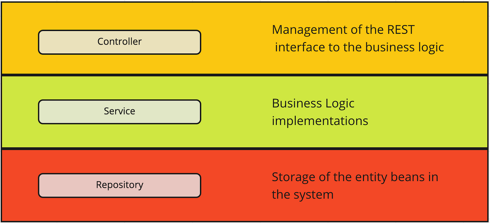
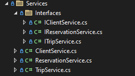

<style>
h1, h4, h2 {
    border-bottom: 0;
    display:flex;
    flex-direction: column;
    align-items: center;
    text-align: center;
      }
      
centerer{
    display: grid;
    grid-template-columns: 6fr 1fr 4fr;
    grid-template-rows: 1fr;

}
rectangle{
    border: 1px solid black;
    margin: 0px 50px 0px 50px;
    width: 200px;
    height: 4em;
    display: flex;
    flex-direction: column;
    align-items: center;
    justify-items: center;
}
Ltext{
    margin: auto auto auto 0;
    font-weight: bold;
    margin-left: 4em
}
Rtext{
    margin: auto;
}

row {
    display: flex;
    flex-direction: row;
    align-items: center;
    justify-content: center; 
}
 </style>
<h1>Uniwersytet Bielsko-Bialski</h1>

&nbsp;

&nbsp;

&nbsp;

&nbsp;

&nbsp;

&nbsp;

&nbsp;

&nbsp;

&nbsp;

<h1 style="text-align: center;"><b>LABORATORIUM</b></h1>
<h1 style="text-align:center"><b>Programowanie dla Internetu w technologii ASP.NET</b></h1>

&nbsp;

&nbsp;

<h2 style="text-align:center; border: none;"><b>Sprawozdanie nr 4</b></h3>
<h2 style="text-align:center; border: none;">Warstwa serwisów</h2>

&nbsp;

&nbsp;

&nbsp;

&nbsp;

&nbsp;

&nbsp;

&nbsp;

GRUPA: 2B / SEMESTR: 6 / ROK: 3

Kacper Lizak / 59443

<div style="page-break-after: always;"></div>

&nbsp;

&nbsp;

&nbsp;

# Cel ćwieczenia

## Celem ćwiczenia było dodanie warstwy serwisów do naszej aplikacji.

# Wprowadzenie

### Serwisy w aplikacjach internetowych stosujemy, aby oddzielić logikę biznesową od warstwy prezentacji, co prowadzi do bardziej czytelnego i modułowego kodu. Serwisy umożliwiają łatwiejsze testowanie aplikacji poprzez izolację logiki biznesowej oraz zapewniają elastyczność poprzez wykorzystanie interfejsów i wstrzykiwanie zależności. Ich zastosowanie pozwala również na łatwe wprowadzanie zmian w implementacji, zachowując jednocześnie spójność z interfejsem 



# Realizacja
### Podczas ćwiczenia utworzono folder dla serwisów oraz ich interfejsów, co pozwoliło na klarowne oddzielenie logiki biznesowej od warstwy kontrolerów. Przedstawiono przykładowy interfejs IClientService, definiujący podstawowe operacje na encji Client, takie jak pobieranie, dodawanie, aktualizowanie i usuwanie. Następnie zaimplementowano przykładowy serwis ClientService, który realizuje te operacje poprzez współpracę z repozytorium IClientRepository.

## Utworzenie folderu dla Serwisów i ich interface'ów

<center>


</center>

## Przykładowy interface ClientService
```cs
public interface IClientService
{
     Task<List<Client>> GetAllAsync();
     ValueTask<Client?> GetByIdAsync(int? id);
     Task InsertAsync(Client client);
     void Update(Client client);
     void Delete(Client client);
     Task SaveAsync();
     bool Exist(Client client);

}
```


## Przykład ClientService

```cs
public class ClientService : IClientService
{
    private readonly IClientRepository _clientRepository;

    public ClientService(IClientRepository clientRepository)
    {
        this._clientRepository = clientRepository;
    }
    public void Delete(Client client)
    {
       _clientRepository.Delete(client);
    }

    public bool Exist(Client client)
    {
        return _clientRepository.Exist(client);
    }

    public async Task<List<Client>> GetAllAsync()
    {
        return await _clientRepository.GetAllAsync();
    }

    public async ValueTask<Client?> GetByIdAsync(int? id)
    {
        return await _clientRepository.GetById(id);
    }

    public async Task InsertAsync(Client client)
    {
        await _clientRepository.InsertAsync(client);
    }

    public async Task SaveAsync()
    {
        await _clientRepository.SaveAsync();
    }

    public void Update(Client client)
    {
         _clientRepository.Update(client);
    }
}
```

## Modyfikacja controlera:

```cs
 private readonly IClientService _clientServices;  
 public ClientsController(IClientService clientRepository)
 {
     this._clientServices = clientRepository;
 }
 ```


## Wstrzyknięcie zależności w Program.cs

```cs
//////////// Services
builder.Services.AddScoped<IClientService, ClientService>();
builder.Services.AddScoped<ITripService, TripService>();
builder.Services.AddScoped<IReservationService, ReservationService>();
var app = builder.Build();
```


# Wnioski
Warstwa serwisów umożliwia klarowne oddzielenie logiki biznesowej od warstwy prezentacji, co przekłada się na bardziej czytelny i łatwiejszy w zarządzaniu kod. Dodatkowo, stosowanie interfejsów i wstrzykiwanie zależności poprzez dependency injection sprawia, że aplikacja staje się bardziej elastyczna i łatwiejsza w testowaniu.