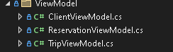

<style>
h1, h4, h2 {
    border-bottom: 0;
    display:flex;
    flex-direction: column;
    align-items: center;
    text-align: center;
      }
      
centerer{
    display: grid;
    grid-template-columns: 6fr 1fr 4fr;
    grid-template-rows: 1fr;

}
rectangle{
    border: 1px solid black;
    margin: 0px 50px 0px 50px;
    width: 200px;
    height: 4em;
    display: flex;
    flex-direction: column;
    align-items: center;
    justify-items: center;
}
Ltext{
    margin: auto auto auto 0;
    font-weight: bold;
    margin-left: 4em
}
Rtext{
    margin: auto;
}

row {
    display: flex;
    flex-direction: row;
    align-items: center;
    justify-content: center; 
}
 </style>
<h1>Uniwersytet Bielsko-Bialski</h1>

&nbsp;

&nbsp;

&nbsp;

&nbsp;

&nbsp;

&nbsp;

&nbsp;

&nbsp;

&nbsp;

<h1 style="text-align: center;"><b>LABORATORIUM</b></h1>
<h1 style="text-align:center"><b>Programowanie dla Internetu w technologii ASP.NET</b></h1>

&nbsp;

&nbsp;

<h2 style="text-align:center; border: none;"><b>Sprawozdanie nr 5</b></h3>
<h2 style="text-align:center; border: none;">Warstwa ViewModel</h2>

&nbsp;

&nbsp;

&nbsp;

&nbsp;

&nbsp;

&nbsp;

&nbsp;

GRUPA: 2B / SEMESTR: 6 / ROK: 3

Kacper Lizak / 59443

<div style="page-break-after: always;"></div>

&nbsp;

&nbsp;

&nbsp;

# Cel ćwieczenia

## 

# Wprowadzenie

### 


# Realizacja
## Utworzenie folderu dla ViewModel'ów


<center>


</center>

## Przykład ViewModel'u

```cs
public class ClientViewModel
{
    public int IdClient { get; set; }
    public string FirstName { get; set; }
    public string LastName { get; set; }
    public int? Pesel { get; set; }
    public string Email { get; set; }
    public string? Phone { get; set; }

    public IEnumerable<ReservationViewModel>? Reservations { get; set; }
}
```


## Modyfikacja  Controlera dla Client
```cs
public async Task<IActionResult> Index()
{
    var clients = await _clientServices.GetAllAsync();
    var clientsList = clients.Select(client => new ClientViewModel
    {
        IdClient = client.IdClient,
        FirstName = client.FirstName,
        LastName = client.LastName,
        Email = client.Email,
        Phone = client.Phone
    }).ToList();
    return View(clientsList);
}
```

```cs
public async Task<IActionResult> Details(int? id)
{
    if (id == null)
    {
        return NotFound();
    }

    var client = await _clientServices.GetByIdAsync(id);
    if (client == null)
    {
        return NotFound();
    }
    var clientViewModel = new ClientViewModel
    {
        IdClient = client.IdClient,
        FirstName = client.FirstName,
        LastName = client.LastName,
        Email = client.Email,
        Phone = client.Phone
    };

    return View(clientViewModel);
}
```

```cs
public async Task <IActionResult> Create([Bind("IdClient,FirstName,LastName,Email,Phone")] ClientViewModel clientViewModel)
{
    if (ModelState.IsValid)
    {
        var client = new Client
        {
           FirstName = clientViewModel.FirstName,
           LastName = clientViewModel.LastName,
           Email = clientViewModel.Email,
           Phone = clientViewModel.Phone,
           IdClient = clientViewModel.IdClient
           

        };
        await _clientServices.InsertAsync(client);
        await _clientServices.SaveAsync();
        return RedirectToAction(nameof(Index));
    }
    return View(clientViewModel);
}
```

```cs
public async Task<IActionResult> Edit(int? id)
{
    if (id == null)
    {
        return NotFound();
    }

    var client = await _clientServices.GetByIdAsync(id);
    if (client == null)
    {
        return NotFound();
    }
    var clientViewModel = new ClientViewModel
    {
        IdClient = client.IdClient,
        FirstName = client.FirstName,
        LastName = client.LastName,
        Email = client.Email,
        Phone = client.Phone
    };
    return View(clientViewModel);
}
```

```cs
 public async Task <IActionResult> Edit(int id, [Bind("IdClient,FirstName,LastName,Email,PhoneNumber")] ClientViewModel clientViewModel)
 {
     if (id != clientViewModel.IdClient)
     {
         return NotFound();
     }

     if (ModelState.IsValid)
     {
         var client = new Client
         {
             IdClient = clientViewModel.IdClient,
             FirstName = clientViewModel.FirstName,
             LastName = clientViewModel.LastName,
             Email = clientViewModel.Email,
             Phone = clientViewModel.Phone
         };
         try
         {
             _clientServices.Update(client);
             await _clientServices.SaveAsync();
         }
         catch (DbUpdateConcurrencyException)
         {
             if (!ClientExists(client.IdClient))
             {
                 return NotFound();
             }
             else
             {
                 throw;
             }
         }
         return RedirectToAction(nameof(Index));
     }
     return View(clientViewModel);
 }
 ```


## Modyfikacja View dla Client:

### Dla index: 
```cs
@model IEnumerable<TripsS.ViewModel.ClientViewModel>
```
### dla pozostałych:

```cs
@model TripsS.ViewModel.ClientViewModel
```


# Wnioski
